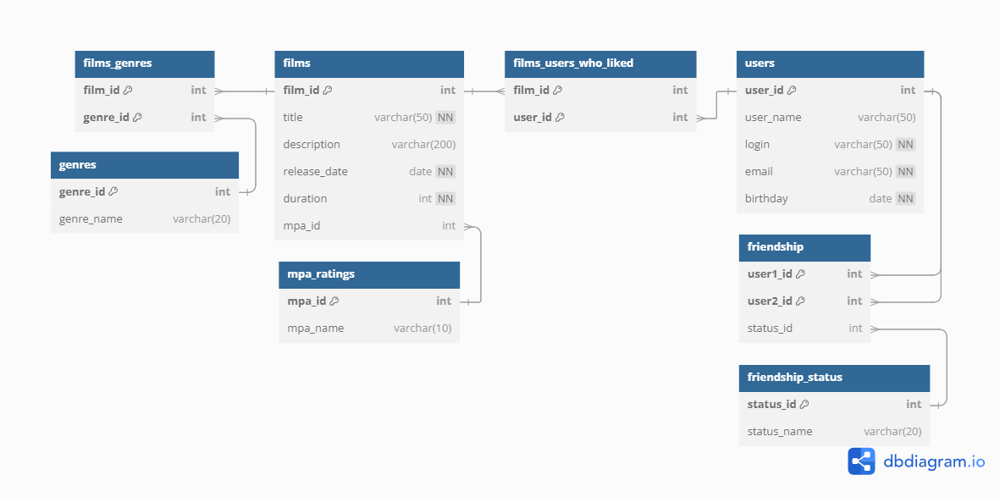

# Filmorate App

### Author: Ilia I (iiv.88@yandex.ru)
### Version: 1.0
#### Initial implementation
- Added models and controllers
- Validation implemented
- Logging implemented
- Unit-tests added
### Version: 2.0
#### Improvements to architecture and business logic
- App refactored - added controller, service and storage layers
- Added new business logic
  - making friendship between users
  - liking films by users
  - querying top 10 liked films
- Added endpoints
  - **/users**
    - **GET /users/{id}** - _get user by id_
    - **GET /users/{id}/friends** - _get list of user friends_
    - **PUT /users/{id}/friends/{friendId}** - _add to friends_ 
    - **DELETE /users/{id}/friends/{friendId}** - _remove from friends_
    - **GET /users/{id}/friends/common/{otherId}** - _get list of common friends_
  - **/films**
    - **GET /films/{id}** - _get film by id_
    - **PUT /films/{id}/like/{userId}** - _add like_ 
    - **DELETE /films/{id}/like/{userId}** - _remove like_
    - **GET /films/popular?count={count}** - _get list of top liked films, {count} defines list size (10 by default)_
### Version: 3.0
#### Added SQL database to store App data

- Added genres and MPA rating to film
- Add users friendship status (not friends, undecided, friends)
- Friendship becomes one-sided (if user1 requests friendship with user2 it means 
user2 in not friend of user1 and user1 is friends of user2)
- Added endpoints
  - **GET /genres** - _get list of film genres_ 
  - **GET /genres/{id}** - _get film genre by id_
  - **GET /mpa** - _get list of MPA ratings_
  - **GET /mpa/{id}** - _get MPA rating by id_